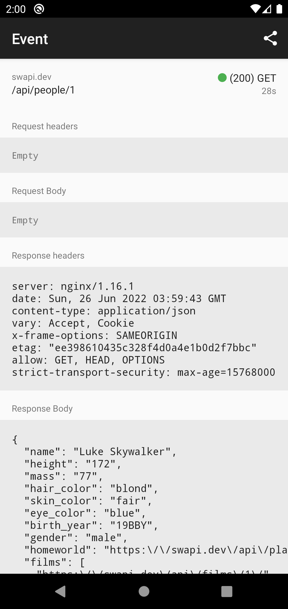

# networklogger
### Konrad Biernacki (<kgbier@gmail.com>)

A lightweight utility for capturing network traffic in Android apps.

| | |
| - | - |
|  |  |

## Features
- Record and inspect HTTP/HTTPS requests and response
- Identify failed or unexpected responses
- Share and export individual requests via the clipboard
  - Additionally export as a `cURL` command

## Example
A sample Android app is included under `./sample`.

## Use

The latest release is available on Maven Central.
``` groovy
dependencies {
  implementation 'dev.kgbier.util:networklogger:1.0'
}
```
Snapshot builds are [available](https://s01.oss.sonatype.org/content/repositories/snapshots/).

### OkHttp

Comes with batteries-included. 

1. Depend on the `okhttp` flavour of this library:
``` groovy
dependencies {
  implementation 'dev.kgbier.util:networklogger-okhttp:1.0'
}
```

2. Add the `NetworkLoggerOkHttpInterceptor` to your OkHttp client:
```kotlin
OkHttpClient.Builder()
    .addInterceptor(NetworkLoggerOkHttpInterceptor(applicationContext))
    .build()
```

3. View logs by starting the included activity:
```kotlin
startActivity(makeNetworkLoggerActivityIntent(context))
```

### DIY

1. Get a handle on the logging repository:
```kotlin
val logginRepo = NetworkLoggerRepository(applicationContext)
```

2. Log a request when it is about to be sent:
```kotlin
loggingRepo.logRequest(
  transactionId = requestTransactionId,
  url = request.url.toString(),
  method = request.method,
  headers = request.headers.toList(),
  body = bodyBuffer.readString(Charsets.UTF_8),
  timestamp = System.currentTimeMillis(),
)
```

3. Log a response when it is received:
```kotlin
loggingRepo.logResponse(
  transactionId = requestTransactionId,
  statusCode = response.code,
  headers = response.headers.toList(),
  body = bodyBuffer.readString(Charsets.UTF_8),
  timestamp = System.currentTimeMillis(),
)
```

4. View logs by starting the included activity:
```kotlin
startActivity(makeNetworkLoggerActivityIntent(context))
```
